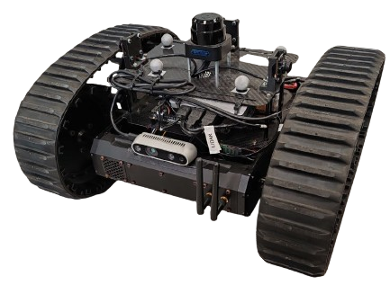

# Prisma Rover: Autonomous Exploration & Mapping Workspace

An advanced, modular ROS 2 Humble robotic workspace designed for autonomous 3D navigation, fuzzy obstacle avoidance, ArUco localization, and YOLO-based semantic object mapping.



> [!NOTE]
> For more detailed technical specifications, changes log, and design notes, please refer to the [docs/](file:///home/andrea/Desktop/Prisma_rover/docs) folder.

---

## Table of Contents
1. [Workspace Architecture](#workspace-architecture)
2. [Docker Integration & Build Profiles](#docker-integration--build-profiles)
3. [Installation & Build](#installation--build)
4. [Running the Simulation](#running-the-simulation)
5. [Package Descriptions](#package-descriptions)
6. [Simulation Assets FAQ](#simulation-assets-faq)

---

## Workspace Architecture

The workspace is organized into modular ROS 2 packages under `ros2_ws/src/`, categorized by functionality:

### 1. Core Navigation & Description
* **`prisma_rover_description`**: Contains the URDF, physics parameters, and 3D visual CAD meshes (chassis, wheels) representing the physical rover.
* **`prisma_rover_sim`**: Houses the Gazebo ignition worlds (`depot.sdf`, `aruco_world.sdf`, `yolo_world.sdf`), and configures topic bridges via `ros_gz_bridge`.
* **`prisma_rover_localization`**: Configures the Extended Kalman Filter (EKF) state estimation nodes, fusing wheel odometry and IMU data.
* **`prisma_rover_navigation`**: Coordinates SLAM Toolbox configurations and Nav2 costmap/path-planner parameters.
* **`prisma_rover_bringup`**: Central package hosting the main orchestration launch files.

### 2. Control & Exploration
* **`prisma_rover_quantum_controller`**: Implements 2D/3D LiDAR-based fuzzy logic obstacle avoidance using look-up tables (LUT). Spreads over vectorized pointcloud processing for minimal latency.
* **`prisma_rover_explorer`**: Handles frontier-based coverage algorithms for autonomous exploration and mapping.
* **`prisma_rover_manager`**: High-level C++ orchestrator coordinating the transitions between localization, mapping, and exploration states.
* **`prisma_rover_teleop`**: Keyboard and joystick teleoperation profiles.

### 3. Perception & AI Mapping
* **`prisma_rover_perception`**: Implements ArUco marker pose detection and coordinate transformations (`aruco_detector` and `aruco_pose_estimation`).
* **`prisma_rover_obj_det_agent`**: Reinforcement learning agent that takes semantic mapping cues to steer exploration towards target search goals.
* **`obj_detection`**: Integrates YOLO-based real-time bounding box segmentation and camera projection to locate objects in 3D coordinate space and log them into persistent storage.

---

## Docker Integration & Build Profiles

To maintain efficiency on various target hardware, this workspace supports **Workspace Profiling** via a multi-stage Docker environment:

| Profile | Included Packages | Excluded/Ignored Packages | Use Case |
| :--- | :--- | :--- | :--- |
| **`base`** | Navigation, Description, localization, Bringup, Sim, Teleop | `obj_detection`, `yolov11_ros2`, `prisma_rover_perception`, `prisma_rover_explorer`, `prisma_rover_obj_det_agent`, `prisma_rover_quantum_controller` | Light simulation, basic mapping |
| **`yolo`** | Navigation, Perception (YOLO & ArUco), RL Agent, Bringup, Sim | `prisma_rover_quantum_controller` | Deep learning, visual semantic mapping |
| **`quantum`**| Navigation, Quantum controller, Bringup, Sim, Teleop | `obj_detection`, `yolov11_ros2`, `prisma_rover_perception`, `prisma_rover_explorer`, `prisma_rover_obj_det_agent` | LiDAR-based fuzzy safety control |
| **`full`** | All Workspace Packages | None | Full integration and training |

At runtime, the `./docker_run.sh` script passes the profile to `entrypoint.sh` which dynamically injects `COLCON_IGNORE` tags in excluded folders to avoid building unnecessary dependencies.

---

## Installation & Build

### Prerequisites
* Docker installed on your host system
* (Optional) NVIDIA Container Toolkit for GPU acceleration during YOLO inference

### Steps
1. Build the Docker image for a specific profile (e.g. `base` or `yolo`):
   ```bash
   ./docker_build.sh base
   ```
2. Launch the container:
   ```bash
   ./docker_run.sh base
   ```
3. Inside the container, compile the workspace:
   ```bash
   colcon build --symlink-install
   ```

---

## Running the Simulation

To launch the full Gazebo simulation along with robot localization and state publishers:

```bash
ros2 launch prisma_rover_bringup sim_system.launch.py profile:=base
```

For fuzzy obstacle avoidance testing (LiDAR):
```bash
ros2 launch prisma_rover_quantum_controller sim_controller.launch.py launch_sim:=true
```

For YOLO semantic mapping:
```bash
ros2 launch prisma_rover_obj_det_agent agent.launch.py visualization:=false
```

---

## Simulation FAQ

### Q1: How can I run the Gazebo simulation in headless mode (no GUI)?
To run the simulation without starting the Gazebo GUI (useful for remote servers or background runs), set the `headless:=true` parameter. For example:
```bash
ros2 launch prisma_rover_quantum_controller sim_controller.launch.py launch_sim:=true headless:=true
```

### Q2: Where are the files containing the mapped objects saved?
The YOLO object detection agent dynamically updates and persists all detected objects and their coordinates into the `stored_objects.json` file located at the workspace root directory.

### Q3: How do I switch active workspace build profiles?
You can select build profiles at runtime using the scripts `./docker_build.sh <profile>` and `./docker_run.sh <profile>`. The active profile dynamically ignores excluded packages using `COLCON_IGNORE` tags under the hood.
