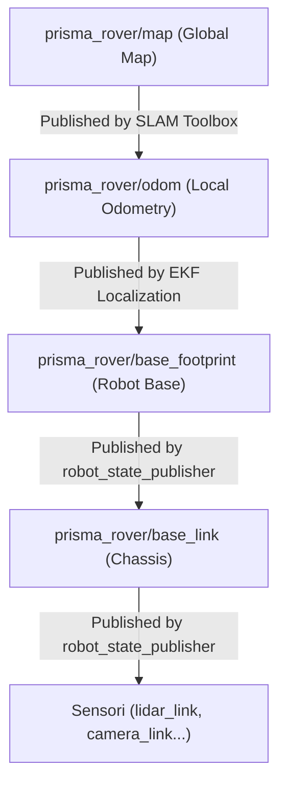

# Refactored Workspace Guide: Prisma Rover (STEP 1 - 8)

This guide describes the architecture of the ROS 2 packages developed for the **Prisma Rover**, explaining in detail the functioning of the different launch files, the role of the EKF localization package, and how they differ and integrate with each other.

---

## 1. ROS 2 Packages Architecture

The workspace in `ros2_ws/src/` is divided into the following main packages and directories, each with a specific responsibility:

1. **`prisma_rover_description`**: Contains the geometric and physical models of the robot (URDF/Xacro), 3D meshes, and visualization configurations (RViz).
2. **`prisma_rover_sim`**: Manages the simulation environment in Ignition Gazebo, loads worlds, and configures the bidirectional topic bridge (`ros_gz_bridge`).
3. **`prisma_rover_localization`**: Implements the Extended Kalman Filter (EKF) for state estimation and filtered odometry of the robot.
4. **`prisma_rover_navigation`**: Manages autonomous navigation (Nav2) and 2D mapping (SLAM Toolbox).
5. **`prisma_rover_teleop`**: A generic and configurable package to manually control the robot using a keyboard or a joystick (DualShock/Xbox).
6. **`prisma_rover_explorer`**: Manages sector-based exploration and Boustrophedon grid coverage navigation.
7. **`prisma_rover_manager`**: High-level C++ task and state manager to orchestrate complex goals (goto, coverage, return home).
8. **`prisma_rover_obj_det_agent`**: Reinforcement Learning (PyTorch LSTM) navigation agent for finding target objects.
9. **`prisma_rover_quantum_controller`**: Look-Up Table (LUT) fuzzy-logic obstacle avoidance controller using 2D LaserScan or 3D LiDAR point clouds.
10. **`prisma_rover_perception`**: A perception grouping directory containing:
    - **`aruco_detector`**: C++ package for fast ArUco marker detection, coordinate extraction, and TF publishing from camera streams.
    - **`aruco_pose_estimation`**: Python package wrapping marker pose estimation. Segments markers from RGB + Depth data using ray casting to find 3D centroids, falling back to IPPE-Square `solvePnP` when depth is unavailable.
11. **`prisma_rover_interfaces`**: Consolidates custom ROS 2 message and action types (e.g., `ArucoMarkers.msg`).
12. **`prisma_rover_bringup`**: Sourced for physical robot hardware bringup launch configurations.


---

## 2. Launch Files Details and Differences

The launch files allow starting individual parts of the robot or the entire integrated system. Each has a precise role:

### A. `description.launch.py` (in `prisma_rover_description`)
- **What it does**: Processes the robot's Xacro files, converting them into URDF. Starts the `robot_state_publisher` node which calculates and publishes the fixed geometric transforms of the robot (the internal TF Tree, e.g., from `base_link` to `lidar_link`). Conditionally starts RViz2 to visualize the robot in 3D.
- **Main parameters**:
  - `use_sim_time` (default: `true`)
  - `namespace` (default: `""` / no namespace)
  - `tf_prefix` (default: `""` / no prefix for frames)
  - `rviz` (default: `false` / if `true` starts RViz2)
  - `publish_camera` (default: `true` / if `false` excludes the camera from the model to save resources)

### B. `sim.launch.py` (in `prisma_rover_sim`)
- **What it does**: Starts the Ignition Gazebo simulation server, spawns the robot in the selected world, and configures the topic bridge. It internally includes `description.launch.py` to load the URDF model.
- **Main difference**: Compared to `description.launch.py`, this file starts the 3D physics simulation engine and the sensor bridge. It does not handle navigation or advanced localization, only the physics and the raw model of the robot.
- **Main parameters**:
  - `world` (default: `maze.sdf`)
  - `headless` (default: `false` / if `true` disables the Gazebo GUI to save CPU/GPU)
  - `publish_camera` (default: `true`)

### C. `localization.launch.py` (in `prisma_rover_localization`)
- **What it does**: Starts the `ekf_node` node from the `robot_localization` package, loading parameters from the `config/localization_ekf.yaml` file.
- **How it works**: This node subscribes to the raw wheel odometry (`/prisma_rover/odom/wheels`) and IMU data (`/prisma_rover/imu/data`). It performs sensor fusion (Extended Kalman Filter) to calculate a much more stable filtered pose, and publishes the dynamic transform between the odometry frame (`prisma_rover/odom`) and the robot's base frame (`prisma_rover/base_footprint`).
- **Main difference**: It does not simulate physics or map the environment. It focuses exclusively on estimating the local pose of the robot by fusing onboard sensor data to reduce wheel drift errors.

### D. `slam.launch.py` (in `prisma_rover_navigation`)
- **What it does**: Starts the SLAM system. Supports two SLAM backends selectable at runtime:
  - **SLAM Toolbox** (`slam_type:=toolbox`): Starts `async_slam_toolbox_node`. Listens to a 2D laser scan and builds a 2D occupancy grid map. Can also work with the 3D Lidar by projecting the point cloud to a 2D scan using `pointcloud_to_laserscan`.
  - **RTAB-Map** (`slam_type:=rtabmap`): Starts the `rtabmap` node from `rtabmap_slam`. Consumes a 3D point cloud directly via `scan_cloud` (or a 2D scan), generates a 2D occupancy grid map, and performs ICP-based loop closure with the point cloud.
- **Lidar mode selection** (`lidar_type`):
  - `2d`: The rover's 2D RPLidar scan (`/prisma_rover/scan`) is used.
  - `3d`: The 3D Livox Mid-360 Lidar point cloud (`/prisma_rover/scan_3d`) is used. If `slam_type:=toolbox`, an intermediate `pointcloud_to_laserscan` node projects the cloud to a 2D scan. If `slam_type:=rtabmap`, the cloud is fed directly to RTAB-Map.
- **Key parameters**:
  - `lidar_type` (default: `2d`): `"2d"` or `"3d"`
  - `slam_type` (default: `toolbox`): `"toolbox"` or `"rtabmap"`
  - `namespace` (default: `prisma_rover`)
  - `tf_prefix` (default: `prisma_rover/`)

### E. `navigation.launch.py` (in `prisma_rover_navigation`)
- **What it does**: Starts the Nav2 suite for robot path planning and motion control. Loads the controller, planner (with `teb_local_planner`), smoother, behavior, and lifecycle manager servers.
- **Main difference**: It does not create the map or local localization. It reads the map and current pose, calculates the optimal path to reach a target (Goal Pose), and sends velocity commands to the robot (`/prisma_rover/cmd_vel`).

### F. `sim_navigation.launch.py` (in `prisma_rover_navigation`)
- **What it does**: It is the **orchestrator launch file**. It includes and starts in a sequenced order all the previously described files:
  1. The world and robot simulation (`sim.launch.py`).
  2. The local EKF localization (`localization.launch.py`).
  3. The SLAM mapping (`slam.launch.py`).
  4. The autonomous navigation (`navigation.launch.py`).
  5. The auxiliary `tf_to_pose_node` node to publish the current pose.
- **Main difference**: Allows starting the entire ecosystem with a single command line. By default, it also starts the graphical 3D simulation (headless:=false).

### G. `teleop.launch.py` (in `prisma_rover_teleop`)
- **What it does**: Allows manual control of the robot. Supports two modes (keyboard or joystick) and allows defining the topic and parameters at runtime.
- **Main parameters**:
  - `mode` (default: `keyboard`): sets the mode (`keyboard` or `joy`).
  - `cmd_vel_topic` (default: `/prisma_rover/cmd_vel`): defines the topic to publish Twist commands.
  - `joy_dev` (default: `0`): ID of the physical joystick device.
  - `config_filepath`: path to the joystick mapping configuration file.
- **Main difference**: It is an agnostic package that can be reused in other ROS 2 projects by properly remapping arguments at launch.

---

## 3. Modular Lidar & SLAM Pipeline

The system supports three navigation modes selectable at runtime via launch arguments:

| `lidar_type` | `slam_type` | Description |
| :---: | :---: | :--- |
| `2d` | `toolbox` | RPLidar 2D scan → SLAM Toolbox. Default baseline. |
| `3d` | `toolbox` | Livox Mid-360 3D point cloud → `pointcloud_to_laserscan` → SLAM Toolbox. |
| `3d` | `rtabmap` | Livox Mid-360 3D point cloud → RTAB-Map (ICP loop closure). |

> [!NOTE]
> In simulation the 3D Lidar is emulated by the `gpu_lidar` Ignition Gazebo plugin.
> The Gazebo plugin publishes on `/prisma_rover/scan_3d/points` (PointCloudPacked);
> the ROS 2 bridge remaps this to `/prisma_rover/scan_3d` (PointCloud2).

### RTAB-Map Key Parameters (`rtabmap.yaml`)
| Parameter | Value | Reason |
| :--- | :---: | :--- |
| `subscribe_scan_cloud` | `true` | Receives 3D PointCloud2 from the Lidar. |
| `Grid/Sensor` | `"0"` | Treats the scan_cloud as a Lidar scan (LaserScan mode). |
| `Grid/FromDepth` | `"false"` | Does not try to generate the grid from RGB-D depth images. |
| `Grid/NormalsSegmentation` | `"false"` | Disables normal estimation (not reliable on sparse simulated clouds). |
| `Grid/MinGroundHeight` | `"-0.1"` | Extends the ground band below zero to handle slight Z variance. |
| `RGBD/CreateOccupancyGrid` | `"true"` | Explicitly enables occupancy grid creation. |

---

## 4. TF Relations Summary (Transform Tree)

The navigation and localization system relies on the correct flow of spatial transforms:



---

## 5. Instructions for Use

### 1. Compilation
Inside the Docker container or via run scripts:
```bash
colcon build --symlink-install
```

### 2. Physical Hardware Bringup (Real Robot)
To start the real robot drivers, EKF localization, state publishers, and sensors:
```bash
ros2 launch prisma_rover_bringup hardware_bringup.launch.py lidar_type:=3d publish_camera:=true
```
- **Lidar Selection** (`lidar_type`):
  - `3d` (default): Launches the real `livox_ros_driver2` node connected to the Livox Mid-360 sensor.
  - `2d`: Launches the real `rplidar_ros` node connected to the RPLidar sensor on `/dev/ttyUSB0`.
- **Camera Selection** (`publish_camera`):
  - `true` (default): Launches the real Intel RealSense camera driver (`realsense2_camera`).
  - `false`: Disables camera driver execution.

> [!IMPORTANT]
> **Host Networking Mode for Livox UDP Broadcast**:
> Because the physical Livox Mid-360 LiDAR communicates over multicast Ethernet UDP packets, the Docker container must be started in **host networking mode** (`--network=host`) for the `livox_ros_driver2` to receive the data stream from the LiDAR.

### 3. Full Launch (Simulation + SLAM + Navigation)
To start the entire system in headless mode with **2D Lidar + SLAM Toolbox** (default):
```bash
ros2 launch prisma_rover_navigation sim_navigation.launch.py headless:=true rviz:=false
```

To start with **3D Lidar + RTAB-Map** (matches real Livox Mid-360 hardware):
```bash
ros2 launch prisma_rover_navigation sim_navigation.launch.py headless:=true lidar_type:=3d slam_type:=rtabmap
```

To start with **3D Lidar + SLAM Toolbox** (3D cloud projected to 2D scan):
```bash
ros2 launch prisma_rover_navigation sim_navigation.launch.py headless:=true lidar_type:=3d slam_type:=toolbox
```

### 3. Launch with RViz and 3D Interface Visualization
To start the full system with 3D interface (Gazebo Client) and RViz:
```bash
ros2 launch prisma_rover_navigation sim_navigation.launch.py headless:=false rviz:=true
```
Once RViz is open, you can send navigation goals using the **2D Goal Pose** tool on the top toolbar.

### 4. Manual Teleoperation (Keyboard or Joystick)
To manually drive the robot using the new `prisma_rover_teleop` package:

* **Via Keyboard (Standard Mode)**:
  Since the input reader requires direct interactive console access (TTY), it cannot be executed directly inside `ros2 launch` (which runs processes in background isolating stdin). It must be run directly using `ros2 run` in a new terminal:
  ```bash
  ros2 run prisma_rover_teleop teleop_keyboard --ros-args -p cmd_vel_topic:=/prisma_rover/cmd_vel
  ```

* **Via Joystick (e.g., PS4 or Xbox Controller)**:
  ```bash
  ros2 launch prisma_rover_teleop teleop.launch.py mode:=joy cmd_vel_topic:=/prisma_rover/cmd_vel
  ```

---

## 6. Complete Testing and Validation of Navigation in Simulation

To systematically verify that the entire navigation ecosystem (`sim_navigation.launch.py`) works correctly and that all features are active, follow this diagnostic checklist.

### A. Preparation and Compilation
1. **Compile the workspace**:
   Ensure all changes to packages are compiled inside the Docker environment:
   ```bash
   ./docker_build.sh base
   ```
2. **Start the container**:
   The new `docker_run.sh` automatically detects if the host uses an NVIDIA GPU (via nvidia-container-toolkit), an AMD/Intel GPU (running DRI passthrough via `/dev/dri`), or if it should fallback to safe software rendering (Mesa `llvmpipe`), also setting `ROS_LOCALHOST_ONLY=1` to prevent Wi-Fi network saturation:
   ```bash
   ./docker_run.sh base
   ```

### B. Launching the Navigation Stack
Inside the container terminal, run the orchestrator launch file. To save CPU if using software rendering or integrated graphics, set `headless:=true` and monitor the state from RViz:
```bash
ros2 launch prisma_rover_navigation sim_navigation.launch.py headless:=true rviz:=true publish_camera:=true
```

> [!IMPORTANT]
> **Network Isolation (ROS_LOCALHOST_ONLY):**
> By default, the run script confines ROS 2 traffic to `localhost` to avoid saturating the local physical network. If you intend to launch RViz2 or teleoperation directly on your host computer terminal (outside Docker), you must export the variable before each command:
> ```bash
> export ROS_LOCALHOST_ONLY=1
> ```

### C. System Validation Checklist

Open a second terminal in the container using `docker exec -it prisma_rover_container bash` and perform the following checks:

#### 1. Verify Nav2 Lifecycle Nodes
Nav2 uses lifecycle nodes managed by a centralized manager. If the stack is ready, all nodes must be in the `active` state.
- **Command**:
  ```bash
  ros2 lifecycle list /prisma_rover/controller_server
  ```
- **Visual Check**: The launch log should report:
  ```text
  [lifecycle_manager-14] [INFO] Managed nodes are active
  ```
  If the nodes are not active, the planners and controllers will not respond to commands.

#### 2. Verify the TF Tree (Transforms Structure)
The TF Tree must be continuous and must not present loops or duplicates.
- **Command**:
  ```bash
  ros2 run tf2_ros tf2_monitor
  ```
- **Verification**: Check that an unbroken chain exists:
  `prisma_rover/map` -> `prisma_rover/odom` -> `prisma_rover/base_footprint` -> `prisma_rover/base_link` -> other links (sensors, wheels).
- **EKF Verification**: Run:
  ```bash
  ros2 run tf2_ros tf2_echo prisma_rover/odom prisma_rover/base_footprint
  ```
  The pose should update continuously (e.g., at 30 Hz as per config) and show consistent values. There should be no high delays or rapid oscillations, which indicate publication conflicts.

#### 3. Verify Robot Topics (Namespacing)
All topics must be under the `/prisma_rover` namespace.
- **Command**:
  ```bash
  ros2 topic list
  ```
- **Verification**: Ensure that the following critical topics are present:
  - `/prisma_rover/scan` (2D laser data from simulated RP-Lidar)
  - `/prisma_rover/map` (Occupancy map created by SLAM Toolbox)
  - `/prisma_rover/odometry/filtered` (State estimation fused by EKF)
  - `/prisma_rover/cmd_vel` (Velocity input for the kinematic controller)
  - `/prisma_rover/pose` (Current pose in PoseStamped format for high-level modules)

#### 4. Verify Conditional Camera (`publish_camera:=true/false`)
To verify that the conditional enablement of the RGB-D camera works correctly to save CPU/GPU resources:
- **With `publish_camera:=true`**:
  - The topic `/prisma_rover/depth/color/points` must be present and show PointCloud2 at high frequency.
- **With `publish_camera:=false`**:
  - The topics `/prisma_rover/color/image_raw` and `/prisma_rover/depth/color/points` must not exist in `ros2 topic list` and the Ignition Gazebo bridge must not consume bandwidth or CPU.

#### 5. Verify SLAM Mapping and Localization
As the robot moves, the 2D map must expand and update.
- **Command**: Open a teleoperation terminal and perform manual movements.
- **Verification**:
  - With `slam_type:=toolbox`: In RViz2, the map `/prisma_rover/map` must show new obstacles scanned by the Lidar, and the robot must not undergo sudden "jumps" in pose.
  - With `slam_type:=rtabmap`: Verify RTAB-Map is running correctly by checking `ros2 topic echo --once /prisma_rover/map`. The map should have non-zero `width` and `height`. Check logs for no `Grid map is empty!` warnings.

#### 6. Navigation Planning Test (Nav2 + TEB)
Verify the effectiveness of the global planner and local controller (TEB).
- **Verification via RViz**:
  - Use the **2D Goal Pose** tool on the top bar to select a target pose in the map.
- **Verification via Terminal**:
  - Send a target pose manually:
    ```bash
    ros2 topic pub --once /prisma_rover/goal_pose geometry_msgs/msg/PoseStamped "{header: {stamp: {sec: 0, nanosec: 0}, frame_id: 'prisma_rover/map'}, pose: {position: {x: 1.5, y: 1.0, z: 0.0}, orientation: {x: 0.0, y: 0.0, z: 0.0, w: 1.0}}}"
    ```
- **Expected Outcome**:
  - A green global path is drawn in RViz from the robot to the target.
  - A local trajectory is planned (lines in RViz showing estimated future states by TEB).
  - Velocity commands are published on `/prisma_rover/cmd_vel`.
  - The robot navigates smoothly, avoiding obstacles, and reaches the target with the desired orientation.

---

## 7. Troubleshooting and Advanced Diagnostics

### A. OpenGL/GPU Rendering Stall & Invalid Lidar Scan Readings (`-inf`)
- **Problem**: When `publish_camera` was enabled, the Ignition Gazebo rendering thread crashed or looped infinitely, causing the GPU-accelerated Lidar sensor `/scan` to publish all readings as `-.inf`.
- **Cause**: CAD-exported COLLADA `.dae` meshes (specifically `prisma_rover.dae` and `pro_tire.dae`) lack proper **2D UV texture coordinates**. When the camera sensor was loaded, Ogre2 tried to generate tangent vectors for normal mapping on these meshes and threw an `ItemIdentityException` that stalled the GPU context. Ogre2's resource manager pre-loads and scans all meshes present in the description package's meshes folder even if they are not explicitly referenced in the active URDF.
- **Resolution**:
  1. We replaced all wheel, chassis, camera, and lidar visual meshes inside [rover_macro.xacro](file:///home/andrea/Desktop/Quantum_obj_rover/ros2_ws/src/prisma_rover_description/urdf/rover_macro.xacro) and [rover_gazebo.xacro](file:///home/andrea/Desktop/Quantum_obj_rover/ros2_ws/src/prisma_rover_description/urdf/rover_gazebo.xacro) with high-performance primitive cylinders and boxes.
  2. We moved the `.dae` files out of the package's meshes folder to prevent Ogre2 from pre-loading and scanning them at initialization.

### B. Local Network Saturation (Wi-Fi Multicast Storm)
- **Problem**: Launching the simulation flooded the local home network with high-frequency ROS 2 packets (`/tf`, `/scan`, images), saturating routers and cutting internet access.
- **Cause**: The DDS middleware uses multicast/broadcast to discover and communicate with other ROS 2 nodes by default.
- **Resolution**: Added `ROS_LOCALHOST_ONLY=1` environment variable in the run script to limit DDS traffic to the localhost loopback interface.

### C. EKF and Lidar Time-Sync & Dropped Messages
- **Problem**: SLAM Toolbox discarded almost all scans and EKF threw transform availability warnings.
- **Cause**: Time synchronization mismatch where EKF published transforms at 15 Hz with a timeout of 0.0s, while Lidar ran at 30 Hz.
- **Resolution**: Optimized the simulated Lidar rate to 10 Hz, EKF update rate to 30 Hz, and set EKF's `transform_timeout` to `0.05` (50 ms) to allow transform interpolation.

### D. RTAB-Map "Grid map is empty!" Warning
- **Problem**: After launching with `slam_type:=rtabmap`, the log continuously shows `Grid map is empty! (local maps=1)` and `/prisma_rover/map` is not published or has zero size.
- **Cause**: RTAB-Map's grid generation mode was misconfigured. When using `subscribe_scan_cloud=true` with a 3D Lidar, the correct grid pipeline is `Grid/Sensor=0` (LaserScan/PointCloud-as-scan mode) with `Grid/FromDepth=false`. Setting `Grid/Sensor=1` (Depth image mode) caused RTAB-Map to expect RGB-D image data for the occupancy grid which was never provided. Also, `Grid/NormalsSegmentation=true` (default) caused the ground segmentation to fail on sparse simulated point clouds.
- **Resolution**:
  - Set `Grid/Sensor: "0"` in `rtabmap.yaml`.
  - Set `Grid/FromDepth: "false"` in `rtabmap.yaml`.
  - Set `RGBD/CreateOccupancyGrid: "true"` explicitly.
  - Set `Grid/NormalsSegmentation: "false"` to bypass normal estimation.
  - Set `Grid/MinGroundHeight: "-0.1"` to handle slight Z variance in the sensor frame.

### E. 3D Lidar Bridge Topic Mismatch (Simulation)
- **Problem**: No point cloud arrives at RTAB-Map or `pointcloud_to_laserscan` when using `lidar_type:=3d`.
- **Cause**: The Ignition Gazebo `gpu_lidar` plugin appends `/points` to the configured `<topic>` name when publishing PointCloudPacked messages. The bridge was configured to listen to `/prisma_rover/scan_3d` but the plugin actually published on `/prisma_rover/scan_3d/points`.
- **Resolution**: Modified `sim.launch.py` to bridge `scan_3d/points` using unidirectional syntax (`[ignition.msgs.PointCloudPacked`) and added a ROS 2 remapping `('scan_3d/points', 'scan_3d')` on the bridge node to expose the unified topic under the expected name `/prisma_rover/scan_3d`.

### F. Livox Mid-360 Parameter Rationale & Physical Consistency
- **Physical Specifications Comparison**:
  - **Horizontal FOV**: The real Livox Mid-360 features a $360^\circ$ horizontal FOV, which matches our `<min_angle>-3.14159</min_angle>` and `<max_angle>3.14159</max_angle>` settings in the URDF.
  - **Vertical FOV**: The real hardware covers a $59^\circ$ vertical FOV, typically spanning from $-7^\circ$ to $+52^\circ$. This corresponds exactly to the simulated angles of $-0.122$ rad to $+0.907$ rad in the Xacro.
  - **Range**: The simulated maximum range is capped at `20.0` meters to balance GPU rendering load and avoid excessive raytracing noise in confined maze/warehouse environments. The real sensor is capable of detecting obstacles up to `40` meters (at 10% reflectivity) or `70` meters (at 80% reflectivity). To run with full physical range, update `<max>20.0</max>` to `<max>40.0</max>` inside [rover_macro.xacro](file:///home/andrea/Desktop/Quantum_obj_rover/ros2_ws/src/prisma_rover_description/urdf/rover_macro.xacro).
  - **Scanning Pattern**: Unlike standard spin-rotational multi-line Lidars, the real Livox uses a non-repetitive rosette-like scan pattern that accumulates density over time. In Gazebo, simulating non-repetitive scan patterns directly is computationally expensive; hence, we approximate the pattern using a high-density $360 \times 60$ multi-layer GPU Lidar, which provides equivalent occupancy grid coverage at a 10 Hz update rate.

### G. Restoring Original Mesh Files (.dae) Safely
- **The Issue**: CAD-exported COLLADA `.dae` files (such as the original `prisma_rover.dae` or `pro_tire.dae`) often lack proper 2D UV texture mapping coordinates. When an RGB-D camera or rendering sensor is loaded, Gazebo's Ogre2 rendering engine attempts to compute tangent vectors for normal mapping. Since no UV map is present, Ogre2 throws an `ItemIdentityException: Tangents are not supported for meshes without texture coordinates` and freezes the rendering thread. This blocks sensor updates, causing the GPU-based Lidar to publish `-inf` values.
- **How to Restore Visual Meshes Without Crashes**:
  If you wish to restore the original CAD meshes, you must fix the UV coordinates or bypass tangent generation:
  1. **Option 1: Mesh Processing and UV Unwrapping (Recommended)**:
     - Import the `.dae` files into Blender.
     - Select each sub-mesh, go to Edit Mode, press `U` and select **Smart UV Project** (or perform a standard Unwrap) to generate valid UV coordinates.
     - Go to the Export menu and export as COLLADA `.dae`. Ensure that the **Include UV Textures** option is checked.
     - Move the processed `.dae` files back into the `prisma_rover_description/meshes/` directory.
  2. **Option 2: Gazebo Material Overrides (No mesh editing required)**:
     - Keep the original `.dae` files in the meshes directory.
     - In the `<gazebo>` reference block for each link in [rover_gazebo.xacro](file:///home/andrea/Desktop/Quantum_obj_rover/ros2_ws/src/prisma_rover_description/urdf/rover_gazebo.xacro), specify a simple color material that does not use shaders requesting tangents:
       ```xml
       <gazebo reference="base_link">
           <material>Gazebo/Grey</material>
       </gazebo>
       ```
     - This forces Gazebo to discard any embedded materials and render the mesh with a basic, safe fallback shader.

---

## 7. Running and Verifying ArUco and YOLO Navigation (Steps 10 & 11)

We have created two dedicated world files and launch files to test and verify ArUco marker tracking and YOLOv11 object mapping within the unified navigation stack.

### A. ArUco Marker Navigation (`aruco_navigation`)

#### How to Launch
Inside the Docker container terminal, run:
```bash
ros2 launch prisma_rover_navigation aruco_navigation.launch.py headless:=true rviz:=false
```
*(If you want to view it visually, set `headless:=false` and `rviz:=true`.)*

#### What It Does & How to Verify
This launch file starts the Gazebo simulator with `aruco_world.sdf` (which contains 3 distinct ArUco markers), initializes EKF localization, starts SLAM Toolbox, launches Nav2 navigation, and runs the `aruco_node` detector.

To verify that the ArUco detector is working properly:
1. **Check Node Outputs**:
   Look at the launch terminal logs. After a 10-second stabilization delay, you should see continuous prints confirming detections:
   ```text
   [aruco_node-16] [INFO] [prisma_rover.aruco_node]: Detected 3 markers.
   ```
2. **Echo the String Coordinates Topic**:
   Verify that the estimated 3D positions of the markers are correctly projected into the map frame:
   ```bash
   ros2 topic echo /prisma_rover/aruco/string
   ```
   You should see outputs specifying the marker labels, positions, and orientations in the `prisma_rover/map` coordinate frame:
   ```text
   drone [0.12 2.79 -0.71 0.18 37.44]
   ```
3. **Check the PoseArray Topic**:
   Verify that the 3D poses are published on the `/prisma_rover/aruco/poses` topic:
   ```bash
   ros2 topic echo /prisma_rover/aruco/poses
   ```
4. **View the Image Output**:
   Check `/prisma_rover/aruco/image` to see raw camera frames overlayed with detected marker IDs and bounding box outlines.

---

### B. YOLOv11 Object Detection & Mapping (`yolo_navigation`)

#### How to Launch
Inside the Docker container terminal, run:
```bash
ros2 launch prisma_rover_navigation yolo_navigation.launch.py headless:=true rviz:=false
```

#### What It Does & How to Verify
This launch file loads `yolo_world.sdf` (a spacious warehouse containing a backpack, a Coke can, and a standing person model). It initializes the YOLOv11 tracker, translates the detected categories, projects their 3D coordinates using depth map alignment, maps their coordinates into the map frame, and stores them in a JSON database.

To verify that the YOLO perception stack is working properly:
1. **Check Detection Output**:
   In the console logs, look for YOLO detection summaries:
   ```text
   [detect_objects_rs.py-17] YOLO detected classes: [9.0, 39.0]
   [detect_objects_rs.py-17] Object 0 (backpack) and object 1 (coke_can) are nearby
   ```
2. **Verify Mapped Label Translations**:
   Confirm that standard YOLO classes are correctly translated to targets (e.g., class `9.0` (traffic light) -> `backpack` and class `39.0` (bottle) -> `coke_can`).
3. **Inspect the Persistent JSON Database**:
   Verify that the nodes are successfully logging these tracked targets to the database file in real-time:
   ```bash
   cat /home/user/ros2_ws/src/obj_detection/scripts/dataset/stored_objects.json
   ```
   The JSON should look like this:
   ```json
   [
       {
           "cls": "backpack",
           "trackID": 1,
           "pos2D": [...],
           "relON": 65535,
           "relUNDER": [],
           "relNEARBY": [2]
       },
       {
           "cls": "coke_can",
           "trackID": 2,
           "pos2D": [...],
           "relON": 65535,
           "relUNDER": [],
           "relNEARBY": [1]
       }
   ]
   ```
   *(Note: The `relNEARBY` relationships are calculated automatically based on the spatial proximity of the detected elements in the map).*


---

## 8. Migrated Control, Exploration, Management, Agent & Perception Packages

The control, exploration, state management, and RL agent packages have been migrated from the legacy workspace to the active namespaced `ros2_ws/src/` workspace. Below are details on these packages along with the perception packages under the `prisma_rover_perception` umbrella:

### A. Quantum Fuzzy Controller (`prisma_rover_quantum_controller`)
* **Purpose**: Performs reactive look-up table (LUT) fuzzy obstacle avoidance. It uses a dynamic `lidar_listener` supporting 2D LaserScan or 3D LiDAR (using fast direct buffer parsing) to extract obstacle ranges/bearings and overrides the Nav2 output (`cmd_vel`) if obstacles are within safety bounds.
* **How to Launch**:
  - Run in simulation (launches Gazebo world, EKF localization, tf_to_pose, and the fuzzy controller):
    ```bash
    ros2 launch prisma_rover_quantum_controller sim_controller.launch.py launch_sim:=true namespace:=prisma_rover
    ```
  - Run on real hardware:
    ```bash
    ros2 launch prisma_rover_quantum_controller controller.launch.py namespace:=prisma_rover
    ```
* **Verification**:
  - Echo `/prisma_rover/min_distance` or `/prisma_rover/obstacle` to verify LiDAR scan listener outputs.
  - Verify namespaced `/prisma_rover/cmd_vel` output matches LUT override settings when the rover approaches obstacles.

### B. Custom Frontier Explorer & Coverage (`prisma_rover_explorer`)
* **Purpose**: Coordinates sector search frontier exploration (`explorer`) and Boustrophedon sweep coverage (`coverage_node`).
* **How to Run**:
  - Run the explorer node:
    ```bash
    ros2 run prisma_rover_explorer explorer --ros-args -r __ns:=/prisma_rover
    ```
  - Run the coverage sweeper node:
    ```bash
    ros2 run prisma_rover_explorer coverage_node --ros-args -r __ns:=/prisma_rover
    ```
* **Verification**:
  - The node subscribes to the map `/prisma_rover/global_costmap/costmap` and poses `/prisma_rover/pose`.
  - Publishes target goals to the action client `/prisma_rover/navigate_to_pose`.

### C. State and Task Manager (`prisma_rover_manager`)
* **Purpose**: High-level C++ coordinator that processes incoming missions via a string command interface (`seed_pdt_rover/command`) and coordinates Nav2 navigation, sweep coverage, or returning to home base.
* **How to Launch**:
  ```bash
  ros2 launch prisma_rover_manager manager.launch.py use_sim_time:=true namespace:=prisma_rover
  ```
* **Verification**:
  - Publish command strings to `/prisma_rover/seed_pdt_rover/command`:
    - `"goto"` (navigates to pre-defined static transform target)
    - `"coverage"` (initiates explorer sweep coverage)
    - `"home"` (sends robot back to starting pose `0,0`)
  - Listen to `/prisma_rover/seed_pdt_rover/state` for active node state responses.

### D. Reinforcement Learning Object Search Agent (`prisma_rover_obj_det_agent`)
* **Purpose**: Navigates the rover using a PyTorch LSTM actor-critic agent to find target objects.
* **How to Run**:
  - Run the object detection agent node:
    ```bash
    ros2 run prisma_rover_obj_det_agent detect_objects_agent --ros-args -r __ns:=/prisma_rover
    ```
  - Run the RL agent controller loop node:
    ```bash
    ros2 run prisma_rover_obj_det_agent agent --ros-args -r __ns:=/prisma_rover
    ```
* **Verification**:
  - The agent dynamically loads the `.cleanrl_model` weights and vocabularies relative to the package directory.
  - Subscribes to `/prisma_rover/objects_detected`, `/prisma_rover/map`, `/prisma_rover/pose`, and sends command sequences to `/prisma_rover/navigate_to_pose`.

### E. ArUco Perception Stack (`prisma_rover_perception`)
* **Structure**: A perception directory acting as a container for two separate ROS 2 packages:
  1. **`aruco_detector` (C++)**: Fast OpenCV-based detector node that reads namespaced camera topics and publishes image/TF details:
     - **Subscribes**: RGB image (`/prisma_rover/camera/color/image_raw`) and Camera Info (`/prisma_rover/camera/color/camera_info`).
     - **Publishes**: Annotated results image (`/prisma_rover/aruco_detector/result_img`), marker transformations list (`/prisma_rover/aruco_detector/tf_list`), and list of detected marker IDs (`/prisma_rover/aruco_detector/aruco_list`).
     - **How to Launch**:
       ```bash
       ros2 launch aruco_detector detector_launch.py camera:=/prisma_rover/camera/color/image_raw camera_info:=/prisma_rover/camera/color/camera_info publish_tf:=true
       ```
  2. **`aruco_pose_estimation` (Python)**: Subscribes to synchronized camera RGB and Depth data, maps detected pixel corners to compute the 3D centroid of each marker, and broadcasts it to map-relative coordinates:
     - **Subscribes**: Camera RGB/depth image topics.
     - **Publishes**: `PoseArray` (`/prisma_rover/aruco/poses`), custom `ArucoMarkers` messages (`/prisma_rover/aruco/markers`), and string formatted logs (`/prisma_rover/aruco/string`).
     - **How to Launch**:
       ```bash
       ros2 launch aruco_pose_estimation aruco_pose_estimation.launch.py use_sim_time:=true namespace:=prisma_rover
       ```


---

## 9. Modular Docker Workspace Profiles

The Dockerized development environment has been refactored to support **modular profiles** to optimize storage, CPU/GPU load, and build times depending on the requirements of your task:

1. **`base`**: Contains only the core ROS 2 and simulation dependencies. Best for lightweight simulation, localization, or teleop testing.
2. **`yolo`**: Contains the core packages plus PyTorch, Ultralytics YOLO, and perception-based object mapping nodes.
3. **`quantum`**: Contains the core packages plus SciPy and the custom quantum controller package.
4. **`full`**: Contains all packages and dependencies (both YOLO and quantum systems).

### Building a Specific Profile

Use the updated `./docker_build.sh` script passing the target profile:
```bash
./docker_build.sh [base | yolo | quantum | full]
```
If no profile is specified, it defaults to `base` and tags the resulting image as `prisma_rover:base`.

### Running a Specific Profile

Use `./docker_run.sh` passing the target profile:
```bash
./docker_run.sh [base | yolo | quantum | full] [software]
```
The script automatically launches the docker image corresponding to the selected profile.

### Workspace Package Filtering (`COLCON_IGNORE`)

Because the workspace directory is mounted inside the container as a host volume, all workspace packages are visible to the container environment. To prevent compilation errors for missing dependencies (e.g. trying to compile `obj_detection` in the `base` profile where PyTorch isn't installed), the `entrypoint.sh` automatically filters the workspace packages at startup:
- It creates `COLCON_IGNORE` files in directories of packages that do not belong to the selected profile.
- It automatically cleans up any stale `COLCON_IGNORE` files when switching back to a fuller profile.

#### Active Package Mappings
- **`base`**: Compiles core components. Ignores `obj_detection`, `yolov11_ros2`, `prisma_rover_obj_det_agent`, `prisma_rover_perception`, `prisma_rover_explorer`, and `prisma_rover_quantum_controller`.
- **`yolo`**: Compiles core components + YOLO perception + RL Agent. Ignores `prisma_rover_quantum_controller`.
- **`quantum`**: Compiles core components + Quantum Fuzzy Avoidance. Ignores `obj_detection`, `yolov11_ros2`, `prisma_rover_obj_det_agent`, `prisma_rover_perception`, and `prisma_rover_explorer`.
- **`full`**: Compiles all packages (ignores nothing).


