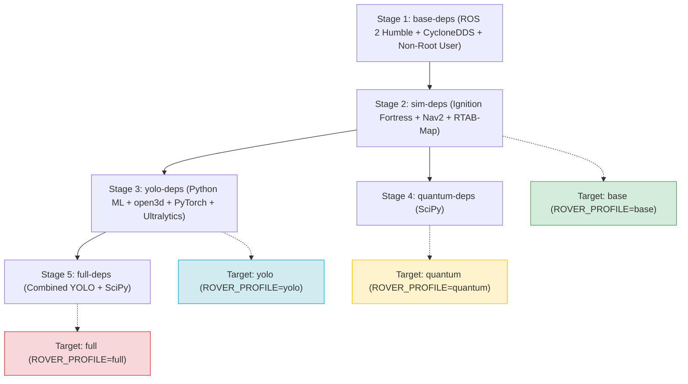

# Project Structure - Prisma Rover

This document describes the overall code organization of the **Prisma Rover** robot, the architecture of the build profiles defined in the multi-stage `Dockerfile`, and the list of executables (nodes) along with their respective configuration parameters and flags.

---

## 1. File Tree and Structure

The main structure of the repository is organized as follows:

```text
Quantum_obj_rover/
├── docker/                             # Main Docker configuration
│   ├── Dockerfile                      # Multi-stage Dockerfile for profiled builds
│   ├── cyclonedds_config.xml           # CycloneDDS configuration for ROS 2 network
│   └── entrypoint.sh                   # Entrypoint script applying COLCON_IGNORE filters
├── ros2_ws/                            # Active ROS 2 workspace mounted in the container
│   └── src/                            # ROS 2 package source code
│       ├── obj_detection/              # Semantic mapping and YOLO detection
│       ├── prisma_rover_bringup/       # Driver nodes for real hardware (Roboclaw, RealSense, Lidar)
│       ├── prisma_rover_description/   # 3D URDF/Xacro model and RViz configurations
│       ├── prisma_rover_explorer/      # Frontiers and systematic exploration
│       ├── prisma_rover_interfaces/    # Custom messages and services
│       ├── prisma_rover_localization/  # EKF localization configuration (robot_localization)
│       ├── prisma_rover_manager/       # Main mission state manager in C++
│       ├── prisma_rover_navigation/    # Nav2 and SLAM nodes and parameters
│       ├── prisma_rover_obj_det_agent/ # RL agent for object search
│       ├── prisma_rover_perception/    # ArUco packages (aruco_detector, aruco_pose_estimation)
│       ├── prisma_rover_quantum_controller/ # Fuzzy obstacle avoidance using LUT
│       ├── prisma_rover_sim/           # Ignition Gazebo worlds and bridge configurations
│       ├── prisma_rover_teleop/        # Keyboard or joystick teleoperation
│       ├── costmap_converter/          # [Third Party] Conversion plugin for Nav2
│       ├── roboclaw_ros2/              # [Third Party] Roboclaw motor controller driver
│       ├── teb_local_planner/          # [Third Party] TEB Local Planner for differential kinematics
│       └── yolov11_ros2/               # [Third Party] ROS 2 wrapper for YOLOv11 tracker
├── docker_build.sh                     # Host script to compile Docker profiles
├── docker_run.sh                       # Host script to run the containers
├── .dockerignore                       # Exclude temporary caches from docker build context
├── cyclonedds_config.xml               # Host-side fallback CycloneDDS config
└── README.md                           # Quick start repository guide
```

---

## 2. Nodes, Executables, and Parameters of Proprietary Packages

Below is the documentation for all executables (Python scripts or C++ binaries) in the proprietary packages, including their runtime flags and configurable ROS 2 parameters.

### A. `obj_detection`
* **Executables/Nodes**:
  * `detect_objects_rs.py` (Main Python node for YOLO + depth alignment)
  * `objects_map.py` (Python node for persistent object mapping and spatial relations in JSON)
* **Launch Files**:
  * `perception_mapping.launch.py`
  * `realsense_launch.py` (real hardware)
* **Available Parameters/Flags**:
  * `camera_topic` (default: `/prisma_rover/camera/color/image_raw`): Input RGB topic.
  * `depth_topic` (default: `/prisma_rover/camera/depth/image_raw`): Input Depth topic.
  * `camera_info_topic` (default: `/prisma_rover/camera/color/camera_info`): Camera intrinsic matrix topic.
  * `confidence_threshold` (default: `0.5`): Detection confidence threshold.
  * `namespace` (default: `prisma_rover`): ROS 2 namespace.

### B. `prisma_rover_bringup`
* **Executables**: None (launches third-party driver nodes).
* **Launch Files**:
  * `hardware_bringup.launch.py`
* **Available Parameters/Flags**:
  * `lidar_type` (default: `3d`): Physical Lidar selection. Values: `2d` (RPLidar S2) or `3d` (Livox Mid-360).
  * `publish_camera` (default: `true`): Enables or disables the physical Intel RealSense camera driver.

### C. `prisma_rover_description`
* **Executables**: None (launches standard `robot_state_publisher` loaded with the processed Xacro model).
* **Launch Files**:
  * `description.launch.py`
* **Available Parameters/Flags**:
  * `use_sim_time` (default: `true`): Sync clock with simulation.
  * `namespace` (default: `""`): ROS 2 namespace.
  * `tf_prefix` (default: `""`): Prefix for the TF tree frames (e.g., `prisma_rover/`).
  * `rviz` (default: `false`): Launches the RViz2 graphical tool.
  * `publish_camera` (default: `true`): Includes camera links in the model geometry.
  * `lidar_type` (default: `3d`): Lidar link geometry selection (`2d` or `3d`).

### D. `prisma_rover_explorer`
* **Executables/Nodes**:
  * `explorer` (Python script for frontier-based exploration)
  * `coverage_node` (Python script for systematic Boustrophedon sweep coverage)
* **Available Parameters/Flags**:
  * `map_topic` (default: `/prisma_rover/global_costmap/costmap`)
  * `pose_topic` (default: `/prisma_rover/pose`)
  * `navigate_to_pose_action` (default: `/prisma_rover/navigate_to_pose`)
  * `map_frame` (default: `prisma_rover/map`)
  * `sector_size` (default: `2.0`): Exploration sector boundary size.

### E. `prisma_rover_localization`
* **Executables**: None (spawns standard `ekf_node` from `robot_localization`).
* **Launch Files**:
  * `localization.launch.py`
* **Available Parameters/Flags**:
  * `use_sim_time` (default: `true`): Time synchronization.
  * `namespace` (default: `prisma_rover`): Isolation namespace.

### F. `prisma_rover_manager`
* **Executables/Nodes**:
  * `rover_manager` (C++ binary node orchestrating higher-level mission tasks)
* **Launch Files**:
  * `manager.launch.py`
* **Available Parameters/Flags**:
  * `use_sim_time` (default: `true`): Clock synchronization.
  * `namespace` (default: `prisma_rover`): Executing namespace.
  * `map_frame` (default: `prisma_rover/map`): Global map coordinate frame.

### G. `prisma_rover_navigation`
* **Executables**: None (manages SLAM and Nav2 suites).
* **Launch Files**:
  * `sim_navigation.launch.py` (Full orchestrator: Gazebo + SLAM + Nav2 + EKF)
  * `slam.launch.py` (Launches SLAM Toolbox or RTAB-Map)
  * `navigation.launch.py` (Launches Nav2 planning/control servers)
  * `aruco_navigation.launch.py` (Navigation targetting ArUco markers)
  * `yolo_navigation.launch.py` (Navigation targetting YOLO detected objects)
* **Available Parameters/Flags**:
  * `slam_type` (default: `toolbox`): SLAM backend choice. Values: `toolbox` or `rtabmap`.
  * `lidar_type` (default: `3d`): Lidar filter settings. Values: `2d` or `3d`.
  * `headless` (default: `true`): Disables Gazebo 3D client GUI for CPU/GPU efficiency.
  * `rviz` (default: `false`): Launches RViz2.

### H. `prisma_rover_obj_det_agent`
* **Executables/Nodes**:
  * `agent` (Python script implementing PyTorch LSTM RL navigation policy)
  * `detect_objects_agent` (Python script focusing YOLO detection on agent target)
* **Launch Files**:
  * `agent.launch.py`
* **Available Parameters/Flags**:
  * `visualization` (default: `false`): Enables matplotlib local visual rendering (must set to `false` in headless Docker environments).

### I. `prisma_rover_perception`
Acts as a container for two separate vision packages:
1. **`aruco_detector` (C++)**:
   * **Executables/Nodes**: `aruco_detector_node`
   * **Launch Files**: `detector_launch.py`
   * **Available Parameters/Flags**:
     * `camera` (default: `/prisma_rover/camera/color/image_raw`): Image input topic.
     * `camera_info` (default: `/prisma_rover/camera/color/camera_info`): Info topic.
     * `publish_tf` (default: `true`): Enables broadcasting coordinates as dynamic dynamic TFs.
2. **`aruco_pose_estimation` (Python)**:
   * **Executables/Nodes**: `aruco_node`
   * **Launch Files**: `aruco_pose_estimation.launch.py`
   * **Available Parameters/Flags**:
     * `use_sim_time` (default: `true`): Sync clock.
     * `namespace` (default: `prisma_rover`): Running namespace.

### J. `prisma_rover_quantum_controller`
* **Executables/Nodes**:
  * `quantum_controller_node.py` (Reactive fuzzy obstacle avoidance logic)
  * `lidar_listener` (Fast NumPy-accelerated 2D/3D LiDAR sensor parser)
  * `quantum_goal_generator` (Local coordinate waypoint planner)
* **Launch Files**:
  * `sim_controller.launch.py` (Full sim launch)
  * `controller.launch.py` (Physical robot bringup configuration)
  * `goal_generator.launch.py` (Path generation)
* **Available Parameters/Flags**:
  * `launch_sim` (default: `true`): Auto-launches Gazebo simulation and local EKF along with the controller.
  * `namespace` (default: `prisma_rover`): ROS 2 namespace.

### K. `prisma_rover_sim`
* **Executables**: None (manages simulation worlds and bridges).
* **Launch Files**:
  * `sim.launch.py`
* **Available Parameters/Flags**:
  * `headless` (default: `false`): Disables 3D Gazebo GUI client.
  * `namespace` (default: `prisma_rover`): Topic bridge namespace prefix.

### L. `prisma_rover_teleop`
* **Executables/Nodes**:
  * `teleop_keyboard` (Interactive terminal key teleoperation script)
* **Launch Files**:
  * `teleop.launch.py` (Joystick / gamepad mapping bridge)
* **Available Parameters/Flags**:
  * `namespace` (default: `prisma_rover`): Remapping target for the `cmd_vel` output.

---

## 3. Dockerfile Multi-Stage Dependency Tree

The `docker/Dockerfile` is structured into 5 sequential build stages to avoid cache duplication and produce 4 deployment target profiles.

> [!TIP]
> **How to correctly view Mermaid diagrams (`.md`)**:
> 1. In **VS Code**: Install the extension **"Markdown Preview Mermaid Support"** to get native rendering inside the Markdown preview window (`Ctrl+Shift+V`).
> 2. On **GitHub/GitLab**: Diagrams wrapped in ` ```mermaid ` are rendered automatically in web views.
> 3. **Online**: Paste the Mermaid code snippet below into the [Mermaid Live Editor](https://mermaid.live) to view or export it to PNG/SVG.

Both the visual **Mermaid** representation and a universal **ASCII text tree** are provided below.

### A. Graphical Diagram (Mermaid)


### B. Textual Representation (ASCII Tree)
```text
[Stage 1: base-deps] (ROS 2 Humble + CycloneDDS + Non-root user)
       │
       ▼
[Stage 2: sim-deps]  (Ignition Fortress + Nav2 + SLAM Toolbox + RTAB-Map)
       │
       ├─────────────────────────────────────────┐
       ▼                                         ▼
[Stage 3: yolo-deps] (PyTorch + YOLO + open3d)  [Stage 4: quantum-deps] (SciPy)
       │                                         │
       ▼                                         │
[Stage 5: full-deps] (YOLO + open3d + SciPy) <───┘
```

Deployment Target Mapping:
```text
  DOCKER PROFILE       COMPILATION BASE          ROVER_PROFILE     COMPILED WORKSPACE PACKAGES
 ───────────────────────────────────────────────────────────────────────────────────────────────────────
  * base             ◄── sim-deps                 base             Core packages and navigation only
  * yolo             ◄── yolo-deps                yolo             Core + YOLO Mapping + RL Agent
  * quantum          ◄── quantum-deps             quantum          Core + Reactive Fuzzy Controller
  * full             ◄── full-deps                full             All packages compiled
```

### Build Stages Explained
1. **`base-deps`**: Built on `ros:humble`. Installs essential build tools (git, pip), configures CycloneDDS, and sets up the non-root `user`.
2. **`sim-deps`**: Inherits from `base-deps`. Installs Ignition Gazebo Fortress, ROS 2 control interfaces/bridges, RViz2, Nav2, EKF Localization, SLAM Toolbox, and RTAB-Map.
3. **`yolo-deps`**: Inherits from `sim-deps`. Installs Python machine learning and 3D vision libraries (`torch`, `ultralytics` for YOLOv11 tracking, `open3d`, `ros2-numpy`).
4. **`quantum-deps`**: Inherits from `sim-deps`. Installs `scipy` required by the fuzzy lookup tables.
5. **`full-deps`**: Inherits from `yolo-deps`. Combines the YOLO packages with `scipy` to compile the full workspace.
